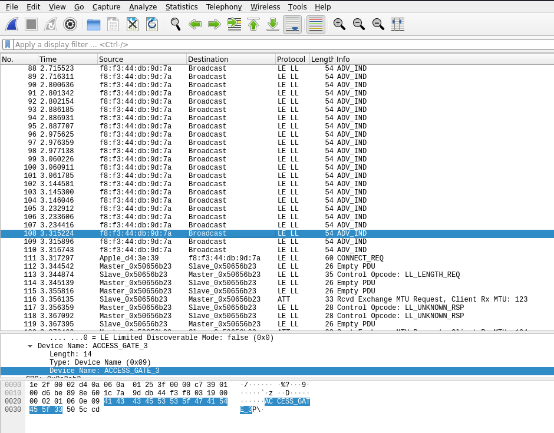
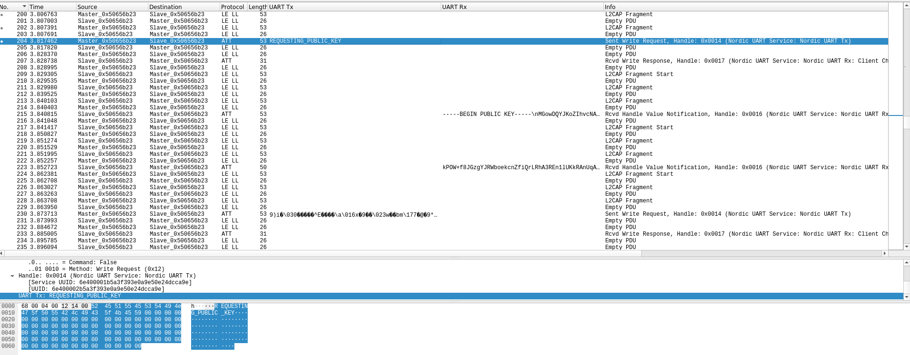
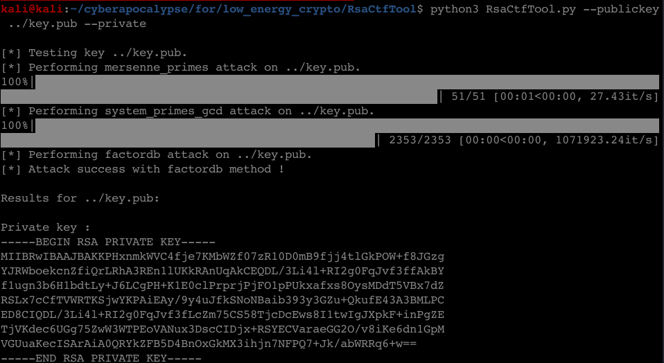
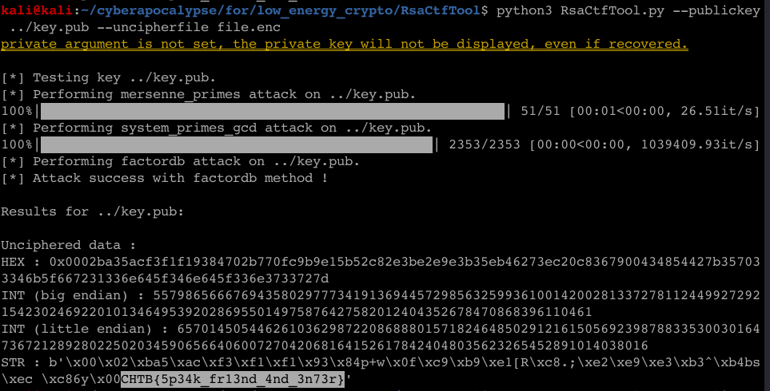

**CTF:** HTB CyberApocalypse 2021 <br>
**CHALLENGE:** Low Energy Crypto<br>
**CATEGORY:** Forensics

## Prompt
>Aliens are using a human facility as a storage unit. The owners of the facility said their access credentials stopped working, but it's based on Bluetooth LE. We managed to install a Bluetooth LE sniffer close to the entrance, and captured some packets. Can you manage to get the access credentials from this capture?

## Walkthrough
Let me preface this write-up by saying that I don't know anything special about Bluetooth and am only vaguely familiar with Bluetooth Low Energy (BLE). However. I love PCAP, finding patterns in data, then turning those patterns into useful things. So with that out of the way, let's get going!

To start, we're provided with a [PCAP](low_energy_crypto.pcapng), which I promptly opened in Wireshark to see what I was dealing with. At first glance, not much stands out other than a device named `ACCESS GATE 3` doing a whole lot of broadcasting.



Since this is a new-to-me protocol, I started clicking through the packets looking for data populated into fields that weren't already extracted into columns by Wireshark. Two fields stood out as containing interesting things: UART Tx, UART Rx. I'd never heard of either of those things, so I started doing some research. At a high level, I learned that a UART is a [Universal Asynchronous Transmitter/Receiver](https://en.wikipedia.org/wiki/Universal_asynchronous_receiver-transmitter) hardware device that is a transmitter plus receiver. It can be installed on something like an access gate, where it can both transmit to and receive from a remote control, key fob, ID card, phone, etc.



Once the UART Tx and UART Rx columns are displayed in Wireshark, we see the following data is exchanged:
1. M -> S: request for public key
2. S -> M: public key
3. S -> M: public key (contd.)
4. M -> S: encrypted gobbledeblob

So it looks like we're dealing with [public-key cryptography](https://en.wikipedia.org/wiki/Public-key_cryptography). In public-key crypto, the sender can encrypt a message with the receiver's public key that can *only* be decrypted by the receiver's private key. However, when insufficiently large values are used to generate the key, it can be mathematically possible to derive one from the other. This weakness is what we're going to take advantage of for this challenge.

First, we need to copy out the public key that we saw sent across two packets:
```
-----BEGIN PUBLIC KEY-----
MGowDQYJKoZIhvcNAQEBBQADWQAwVgJBAKKPHxnmkWVC4fje7KMbWZf07zR10D0m
B9fjj4tlGkPOW+f8JGzgYJRWboekcnZfiQrLRhA3REn1lUKkRAnUqAkCEQDL/3Li
4l+RI2g0FqJvf3ff
-----END PUBLIC KEY-----
```

Next, we can use something like [RsaCtfTool](https://github.com/Ganapati/RsaCtfTool) to attempt to derive the private key from our provided public key, which I saved in `key.pub`. It's successful! <br>
*NOTE: While this step wasn't strictly necessary, but that we can recover the private key indicates that we're on the right track.*



Now, we can make the assumption that the gobbledeblob that's next sent by the Transmitter is a passphrase encrypted with the receiver's private key. Since we now have that private key, we should be able to recover the plaintext, which I'm hoping is the flag. Next, copy *only* the UART Tx value as Hexstream out of Wireshark*, and use the command line utility `xxd` to write the encrypted blob to `file.enc`.

\**Note: I had some issues getting this to behave consistently for some reason and had some nudges from a teammate to make sure the bytes lined up as expected*

```bash
echo -n 392969b018ffa093b9ab5e45ba86b4aa070e78b839abf11377e783626d7f9c4091392aef8e13ae9a22844288e2d27f63d2ebd0fb90871016fde87077d50ae53800000000000000000000000000000000000000000000000000000000000000000000000000 \
| xxd -p -r > file.enc
```

Finally, we can run RsaCtfTool.py again, specifying the weak public key and encrypted text as arguments, to see if the plaintext value of the UART Tx transmission can be recovered and.... success!


