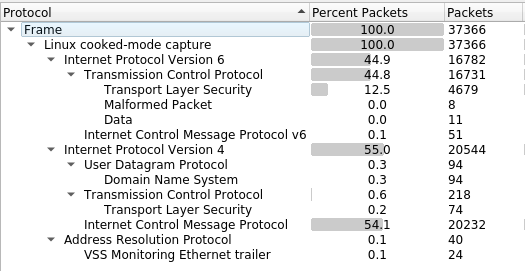
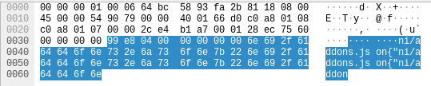
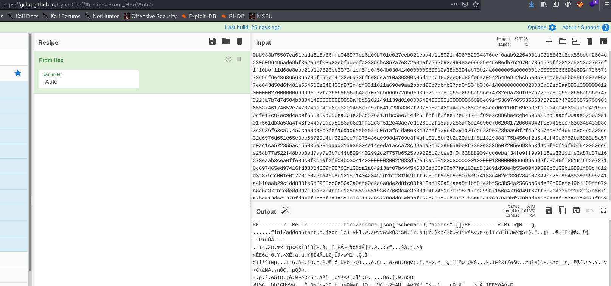
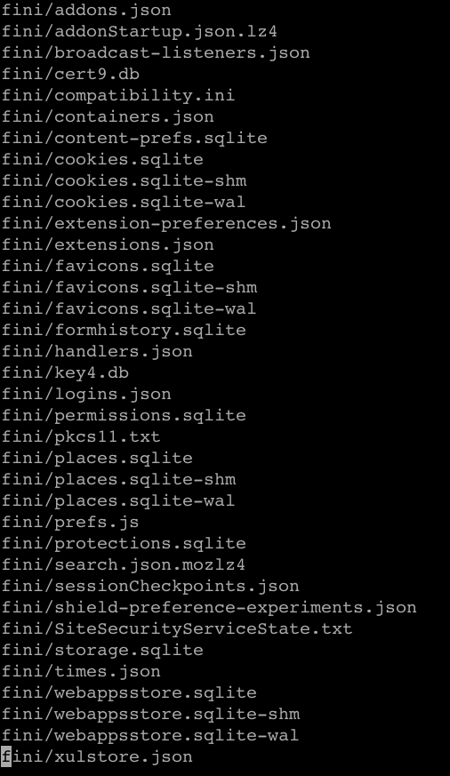

**CTF:** HTB CyberApocalypse 2021 <br>
**CHALLENGE:** Oldest Trick in the Book<br>
**CATEGORY:** Forensics

## Prompt
>A data breach has been identified. The invaders have used the oldest trick in the book. Make sure you can identify what got stolen from us. [Provided pcap: older_trick.pcap](older_trick.pcap)

## Walkthrough
Hello PCAP, my friend. What do you have for me today?



After firing up Wireshark and looking at Statistics->Protocol Hierarchy, there's an inordinate number of ICMP packets. In addition to being useful for host discovery, ICMP requests have a data field that can be used for smuggling data out of a network in small chunks. I'd certainly consider this an [old trick](https://blog.trendmicro.com/trendlabs-security-intelligence/phishing-trojan-uses-icmp-packets-to-send-data/). Looking through a handful of the requests, there's definitely data in them that we can try to reassemble.



The command line utility tshark is great for extracting specific fields from pcap. The line below writes all of the ICMP requests in the pcap to a file named icmp_data for easier analysis.

```bash
tshark -Y "icmp && ip.src == 192.168.1.7" -T fields -e "data.data"  -r older_trick.pcap > icmp_data
```

However, now we have to deal with the fact that data appears in near-triplicate as shown above in Wireshark. No biggie! After some trial and error to find the right indices, we can run `icmp_data` through a quick python loop to pull out just one instance of the data per packet and output it as a single line:

```python
with open('icmp_data', 'r') as f:
    for l in f:
        print(l[16:48], end = '') # passing end = '' prints the whole thing as a single blob without newlines
```

We're left with a file of just hex. A quick decode in [CyberChef](https://gchq.github.io/CyberChef/) -- The Cyber Swiss Army Knife -- gives both human-readable text and a bunch of gobbledegook. However, the "PK" at the beginning looked familiar to me. This is the start of a file header for a zip file.



In addition to creating hexdumps, the command line utility `xxd` can also turn hex back into files!

```bash
xxd -r -p icmp_16_48 > extracted.zip
```

[oldesttrick zip file extracted from icmp requests](oldesttrick_extracted.zip)

Unzipping the zip looks an awful lot like a Mozilla profile directory.



The file `logins.json` (below) contains an encrypted password that can be recovered with something like [this firefox decrypt project](https://github.com/unode/firefox_decrypt).

```
{"nextId":2,"logins":[{"id":1,"hostname":"https://rabbitmq.makelarid.es","httpRealm":null,"formSubmitURL":"https://rabbitmq.makelarid.es","usernameField":"username","passwordField":"password","encryptedUsername":"MDIEEPgAAAAAAAAAAAAAAAAAAAEwFAYIKoZIhvcNAwcECMeab8LuajLlBAixWaWDdSvdNg==","encryptedPassword":"MEoEEPgAAAAAAAAAAAAAAAAAAAEwFAYIKoZIhvcNAwcECGKAhjI0M93wBCDzNVgOAQ9Qn77aRp791mOjsyTjoAINAym/9+wmwdI/hQ==","guid":"{aed76f86-ae6a-4ef5-b413-be3769875b0f}","encType":1,"timeCreated":1618368893810,"timeLastUsed":1618368893810,"timePasswordChanged":1618368893810,"timesUsed":1}],"potentiallyVulnerablePasswords":[],"dismissedBreachAlertsByLoginGUID":{},"version":3}
```

Download, run, and voila! A wild flag appears!

```
Website: https://rabbitmq.makelarid.es/  
Username: 'Frank_B'  
Password: 'CHTB{long_time_no_s33_icmp}'
```
