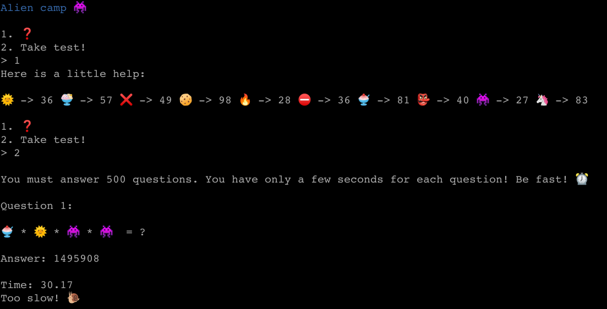
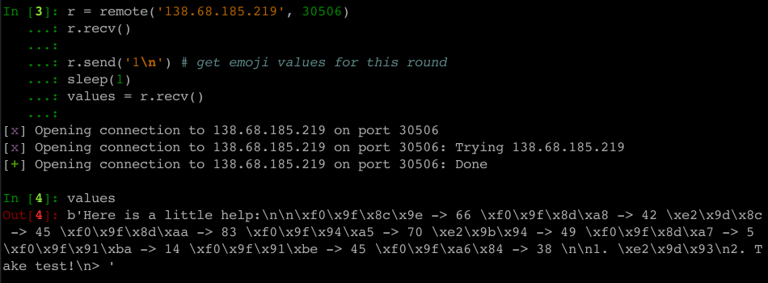

**CTF:** HTB CyberApocalypse 2021 <br>
**CHALLENGE:** Alien Camp<br>
**Category:** Miscellaneous

## Prompt
>The Ministry of Galactic Defense now accepts human applicants for their specialised warrior unit, in exchange for their debt to be erased. We do not want to subject our people to this training and to be used as pawns in their little games. We need you to answer 500 of their questions to pass their test and take them down from the inside.

We're also given an IP and port.

## Walkthrough

`nc <IP> <port>`


*NOTE: I had to `apt install fonts-noto-color-emoji` and restart the terminal to get the emoji to load, though this wasn't strictly necessary for solving the challenge programmatically.*

Cycling through the different menu options, we find that option 1 prints the value each emoji is assigned, and option 2 begins the test. By trying this a few times, it became obvious that the values of each emoji change every time we connect, so we'll need to dynamically assign them each run instead of hard-coding the value assignments.



Now that we have an idea of what we're dealing with, we can put together a general outline of what needs to be done:
1. Build a mapping of emoji -> value assignments
2. For each equation
  1. Parse equation
  2. Replace emoji with their values
  3. Do math

A note on tooling: For this challenge I used IPython--an interactive command-line terminal for Python--to experiment and built my actual .py script along the way as things worked. This was also my first time working with pwntools, which made interacting with the remote service a breeze!

### Finding the value of an emoji
Remember when I said rendering the emoji wasn't actually useful for programmatic interaction? Yeah, this is why:



When I see something like this, my analyst brain goes to straight to regex, so that's what I used to parse both the emoji value assignments and the mathematical challenge statements themselves. A few notes about the regex I used:
- The `r` at the start of the pattern string says "hey Python, this is a raw string so anything I say is a literal." This saves us from needing extra backslashes (\\) to escape the start of the hex (\x00) values. It's not strictly necessary, but certainly makes the pattern easier to read!
- In regex, putting something in parenthesis makes it a capture group, meaning it can be referenced later. An example of this is `([0-9]{1,3})` at the end of the pattern string, which is used to extract the value assigned to a given emoji. But sometimes we want to group things together and *not* capture them, this is denoted by placing ?: at the start of the parenthesized statement. I used this technique to avoid capturing individual hex characters, and only store the full value of the emoji. This has a couple benefits: less data is being stored in memory (this is negligible for a small script like this, but always something to keep in mind), and it's easier to index the captured values since there's no extraneous data included.


I pulled these out into a dictionary of ``{emoji : value}``, then proceeded to parse the math equation in a similar manner.

### Parsing and solving equations
I only needed to make a few minor changes to my initial regex pattern to handle the operators (\*, +, -) instead of decimal values. From there, I constructed a string of `X + Y - Z * Q` to make sure I was generating it correctly. On a whim, I tried passing the equation string straight to `eval()` to handle the actual math and was pleasantly surprised that it worked! I really wasn't looking forward to doing more type casting, checks for operator type, or dealing with order of operations, so this was a fun find.

### Now do it 500 times

Next step was to throw it in a loop, not forget to print out the final message received from the server, and tada! Flag!


### Final solution script
```python
from pwn import *
import re

r = remote('138.68.185.219', 30506)
r.recv()

r.send('1\n') # get emoji values for this round
sleep(1) # taking this out broke things, so in it stays
values = r.recv()

pattern = r'((?:\\x[0-9a-f]{2}){2,5}) -> ([0-9]{1,3})'
values_list = re.findall(pattern,str(values))

assignments = {}

for i in values_list:
    assignments[i[0]] = i[1]

# assignments is now a dictionary of { string of emoji symbol : string of emoji value }

r.send('2\n') # start test
c = 1

while c < 501: # they said there were 500 questions, so let's gooooo
    chal = r.recv()
    pattern = r'((?:\\x[0-9a-f]{2}){2,5})\s{1,2}([-+*=])'
    values_list = re.findall(pattern,str(chal))

    operation = ""

    for i in values_list:
        operation += assignments[i[0]]
        if i[1] == '=': # found the equals sign! time to break and do math
            break

        operation += i[1]

    res = str(eval(operation)) # can't believe this worked
    print('Challenge #' + str(c) + ': ' + operation + ' = ' + res) # not strictly necessary to print here, but it's satisfying to watch the progress
    r.send(res+'\n')
    c+=1

print(r.recv()) # don't forget to print the flag!!
r.close() # thou shalt always close that which you open
```
