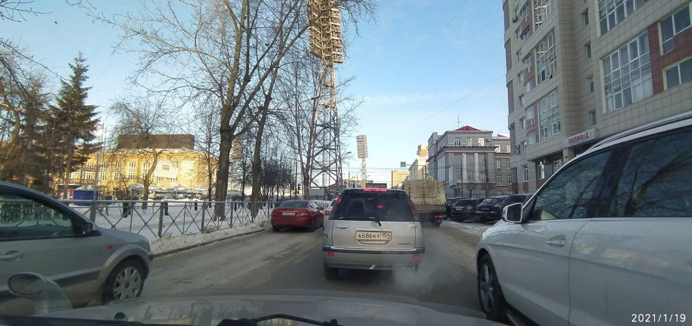
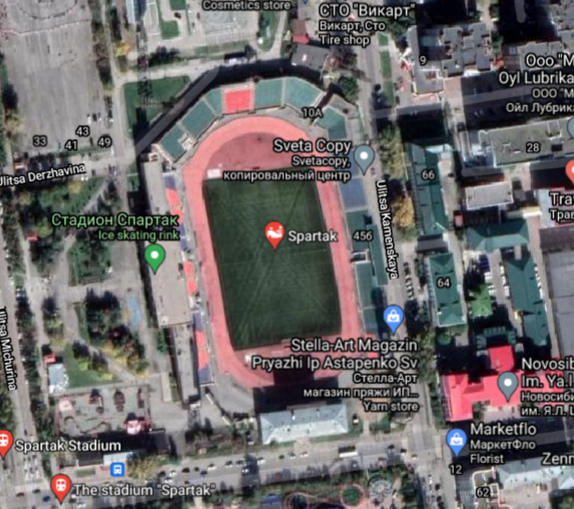
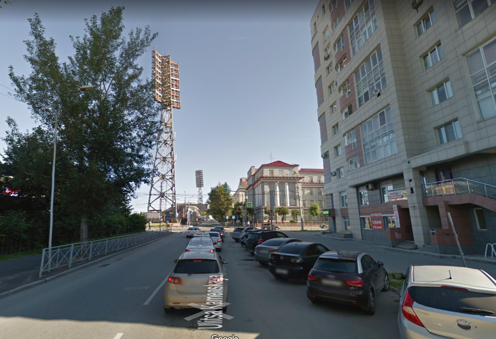

**CTF:** UMDCTF2021  
**CHALLENGE:** Justin2 
**CATEGORY:** OSINT 

## Prompt
>My friend is in danger and this was the only picture he could send me. Can you find the name of the street he is on?  
>

## Walkthrough
I think this was the first time I've tried my hand at a "can you find where in the world this picture is from" challenge. I like to think that I'm pretty good at search-engine-fu and putting pieces of an analytic puzzle together, so this was a very fun challenge for me! I'll walk through my process, what worked and what didn't, and how I got to the right street in the end.

The first thing that stood out to me was the red text on the building to the right of the street. I don't know Russian, but I can stumble my way through Cyrillic when I need to. I determined this sign said "жилфон," which a translator engine said meant "real estate agency."

The next clue I picked out was the license plate number in the image: `A 686 KY 154`. [The Wikipedia page for vehicle registration plates of Russia](https://en.wikipedia.org/wiki/Vehicle_registration_plates_of_Russia) confirms this follows the format of a Russian license plate, and that 154 is the regional code for Novosibirsk Oblast. *([Oblasts](https://en.wikipedia.org/wiki/Oblast) are administrative divisions found in several Eastern European countries.)*

Combining these two facts with general observations from the photo, I started poring over Google Maps for locations that met the following criteria:
- Novosibirsk Oblast in Russia
- жилфон on the right hand side of a one-way street with angled parking
- next building over probably has a red roof

After spending a couple hours clicking through every real estate agency in Novosibirsk Oblast multiple times, looking at both satellite and street view, it was time for a change. Either I had something wrong, or I didn't have enough information to correctly pinpoint the location. Another significant landmark in the picture was the pair of the tall structures in the background that looked like stadium lights. Soooo I searched Novosibirsk Oblast for "stadium" in Google Maps. 

There's only one street along the stadium that's close enough to see the lights, has the stadium on the left-hand side, AND has a strip of buildings on the right. I dropped into street view and.... [found it!](https://www.google.com/maps/@55.0367422,82.9267614,3a,75y,353.86h,102.25t/data=!3m6!1e1!3m4!1s5o8NN59Tgqb1gaDzWK4fwQ!2e0!7i13312!8i6656) It's no wonder I couldn't find the street based off of the placement of real estate agencies, because Google Maps doesn't have one! Just goes to show that OSINT can be both an art and a science, and that not all sources contain the same data. When something isn't working based off initial assumptions, challenge those assumptions, look for additional data points, and try again.

