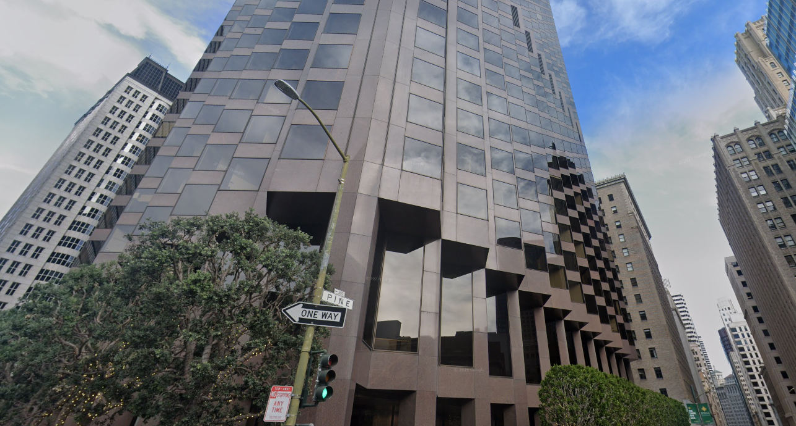
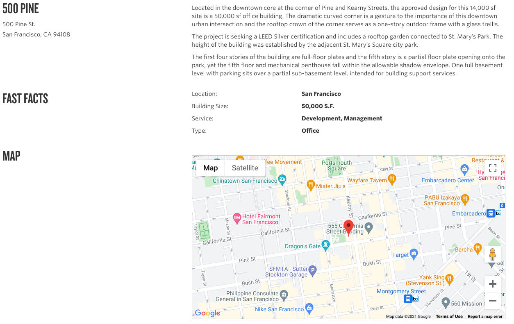
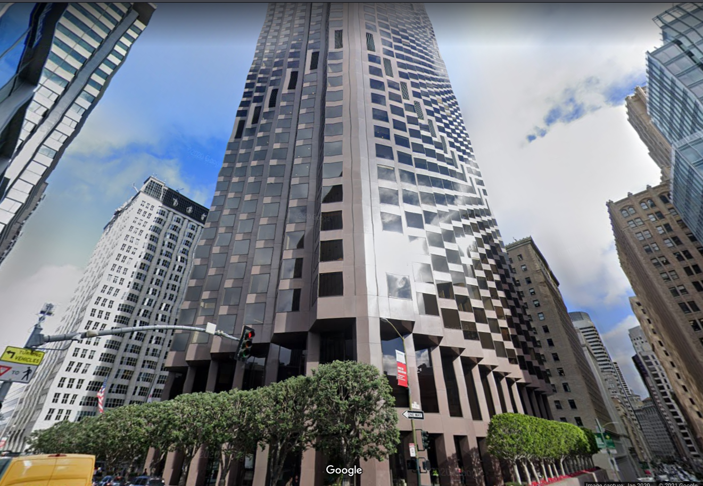

**CTF:** UMDCTF2021  
**CHALLENGE:** Traveling 
**CATEGORY:** OSINT 

## Prompt
>I've been walking along the streets of this cool city and saw this neat looking building, but can't quite remember its name. Can you help me out? 
>
>

## Walkthrough
From the picture, we know a few things:
1. There's a skyscraper (or at least a really tall building that goes off-frame).
2. It's on the 500 block of Pine St.
3. There are green and gold flags on a lamp post to the far right of the image. I don't recognize them, but they may help determine if we're in the right ballpark when we start poking around street view

I've found it's important to not overthink things when first starting to find a piece of information. I have no clue what city or even part of the world we're in, so I started with what we know: "500 pine street skyscraper." Yes, that was my Google search criteria. The top result of my Google search was for a [property company in San Francisco](https://lpcwest.com/development/500-pine/) that has a project at 500 Pine. They even have Google Maps embedded on their website.

From here, we can quickly drop into [Google street view](https://www.google.com/maps/@37.7917046,-122.4043541,3a,75y,41h,123.39t/data=!3m6!1e1!3m4!1savhpv7W65w5Ovwxh0FUkCA!2e0!7i16384!8i8192), and we've found it! The building structure is the same, the street signs line up, and the green signs on the lamp post match up as well. I'll never cease to be amazed at what can be tracked down from what seems like so little information, it's all in knowing where and how to look.

