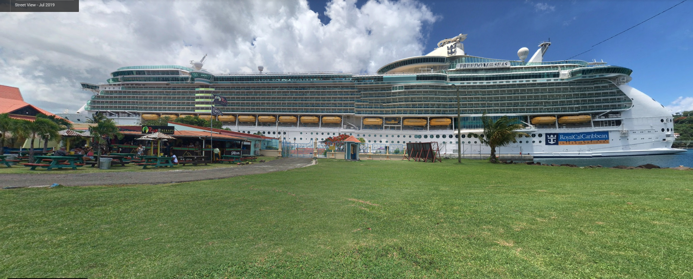
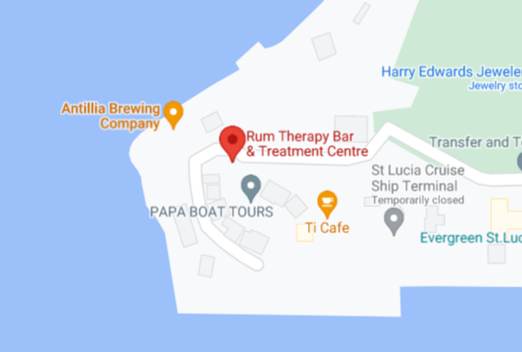

**CTF:** UMDCTF2021  
**CHALLENGE:** Vacation 
**CATEGORY:** OSINT 

## Prompt
>My mom told me she went to this amazing brewing company in the Caribbean and when I asked her the name of the place, she sent me a picture of her ship. Can you help me find the name of this brewing company? 
>
>

## Walkthrough
In front of the cruise ship, there's an establishment with a sign that says "Rum Therapy." A quick [google search](https://www.google.com/search?q=rum+therapy+bar+caribbean) for "rum therapy bar caribbean" indicates the photo was taken in St. Lucia, and zooming in on the map shows there's a brewery right next door. Looks like we found our spot! 

### Side Note
When I initially looked at this challenge, the CTF had just gone live and there was no image included with the prompt. Thinking I only had the prompt itself to run with, I postulated that the mom taking a picture of their cruise ship must have somehow been linked to the name of the brewery (i.e. name collision). I found a [list of cruise ships](https://en.wikipedia.org/wiki/List_of_cruise_ships) and a list [breweries in the Caribbean](https://en.wikipedia.org/wiki/Beer_in_the_Caribbean#List_of_beers_and_breweries), but nothing matched. I decided to move onto other challenges, and was surprised to find that an image had appeared the next time I checked back!
