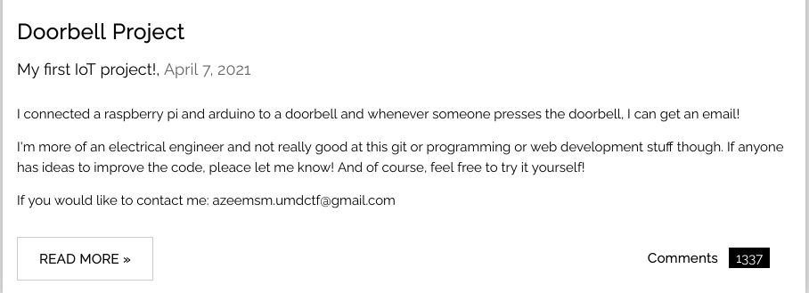
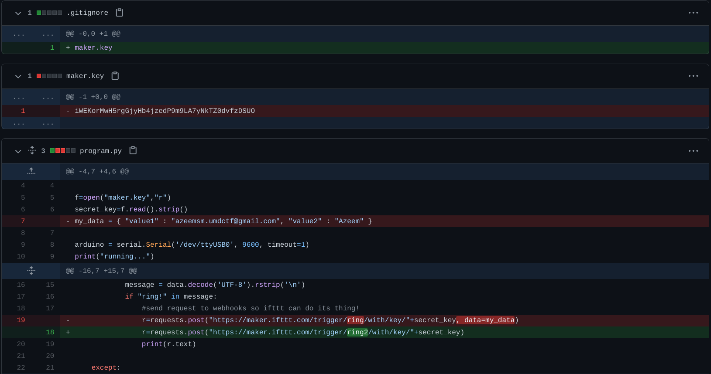
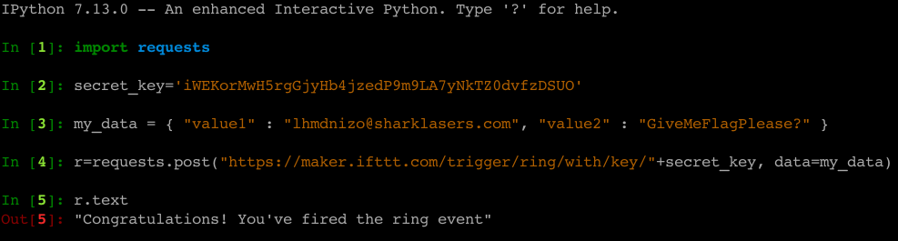
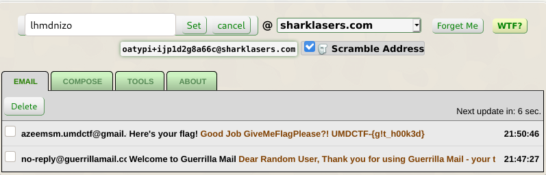
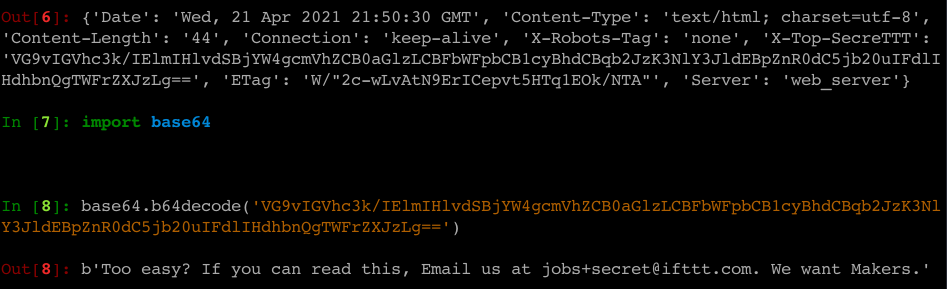

**CTF:** UMDCTF2021 <br>
**CHALLENGE:** IOT Project<br>
**CATEGORY:** Web<br>

## Prompt
>IoT is so cool and secure! Check out my project from April 7 at https://azeemsm-umdctf.github.io/

## Walkthrough
Browsing to the provided web page, there are a handful of blog posts. The prompt indicates this is specific to their April 7th project, so let's check that out. The post states that they've connected a Raspberry Pi and Arduino to a doorbell, so that they get an email every time someone rings it.



Since this webpage is hosted on GitHub, we can find the page source at https://github.com/azeemsm-umdctf/azeemsm-umdctf.github.io. The current version of the project includes the below Python file, which reads `maker.key` for a requisite `secret_key` value. Then, it POSTs to an IFTTT maker link. [IFTTT (If This Then That)](https://ifttt.com/) allows a user to program a response to various event types based on a trigger for any number of [services](https://ifttt.com/services) and is perfect for the 'get an email when the doorbell rings' scenario.

```Python
#Azeem's Code
import serial
import time
import requests

#Read secret key from file for security!
f=open("maker.key","r")
secret_key=f.read().strip()

#Connect to arduino through serial (mine is on /dev/ttyUSB0 but this may change depending on which port I plug into)
arduino = serial.Serial('/dev/ttyUSB0', 9600, timeout=1)
print("running...")

#Never stop!!!
while True:
    try:
        #read from arduino
        data=arduino.readline()
        if data:
            #decode the data as UTF-8 (normal text) and remove new line
            message = data.decode('UTF-8').rstrip('\n')
            if "ring!" in message: #check if it says ring! (not sure what else it could be at the moment looking at the arduino code)
                #send request to webhooks so ifttt can do its thing!
                #send post request through ifttt webhook (this will send me email)
                r=requests.post("https://maker.ifttt.com/trigger/ring2/with/key/"+secret_key)
                print(r.text)

    except:
        #there was an error uh oh lets exit
        arduino.close()
        break
````

From here, I started looking through diffs in the commit history on April 7th for anything *interesting*. One commit in particular stood out for several reasons.
* The file `maker.key` was added to the `.gitignore` folder, which means it won't be pushed to GitHub for any subsequent commits. Fortunately for us, this doesn't remove it from commit history ;-)
* The commit message said "different hook to only send me email."
* The IFTTT trigger changed from `ring` to `ring2`, which no longer includes the following in the POST request: `my_data = { "value1" : "azeemsm.umdctf@gmail.com", "value2" : "Azeem" }`. This must be the hook change referenced in the commit message.



At this point, we know enough to try triggering the IFTTT event ourselves. I like to use IPython, an interactive command-line terminal for Python, for quick scripts like this. Borrowing code from Azeemsm's commit history, we can assign `secret_key` to the `maker.key` value pulled from the commit history, and replace their email address with one from [Guerilla Mail](https://www.guerrillamail.com/) in hopes that we can be sent the doorbell notification instead. The Guerilla Mail service gives users a temporary account just by browsing to the site, no information needed. It's great for things like this where I don't want to provide my own email address.



Once the event is fired in IPython, an email shows up in our Guerilla Mail temporary inbox containing the flag!



<br>

**Easter Egg:**
During the testing process, I checked the HTTP response headers received when we "fired the ring event" and chuckled at the encoded header set by IFTT.


