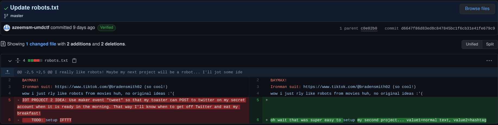

**CTF:** UMDCTF2021  
**CHALLENGE:** IOT Project2 
**CATEGORY:** Web 

## Prompt
>Yeah im such a good engineer, got another project in just under a week later on the 13th. My resume is going to look so good with all these projects! Check out my project at https://azeemsm-umdctf.github.io/ (don't get the account suspended or there will be disqualifications)

## Walkthrough

From the above blog post on April 13th, it looks like we need to find the secret twitter account used by the fabulous tweeting toaster. Digging into the commit history on April 13th, there isn't any new code introduced, but there are a number of changes we can poke through. Don't be misled by the creation of `supersecretflag.txt`, it's a lie ;-)

Looking through the commits individually, one change to `robots.txt` stands out. It references a maker event called 'tweet' and that `value1` is normal text and `value2` is a hashtag. It can't be a coincidence that they specifically chose the word "hashtag" for a Twitter-related event; that's going to come in handy soon.

This appears to be building on the previous challenge, IoT Project, which also used IFTTT triggers and similarly named variables. It makes sense that we can try updating some of the parameters to see what happens:
- **ring:** change this value to "tweet," which will hopefully trigger a Twitter event
- **value1:** in the previous challenge, this was only used in the text greeting, so it probably doesn't matter what we put here
- **value2:** it can't be a coincidence that the word "hashtag" was used to describe a value used to create a "tweet" event, so let's try a unique string that can be searched on Twitter
- **secret_key:** we don't have any updated information here, so it's probably best to keep it the same so there are fewer moving parts

Back to trusty IPython to fire our new "tweet" event.

A quick Twitter search for our `#superSecretHashtag` and we've found the toaster's secret account!

Lastly, using `xxd` to base64 decode the hex string found in the Twitter profile gives us our flag!

